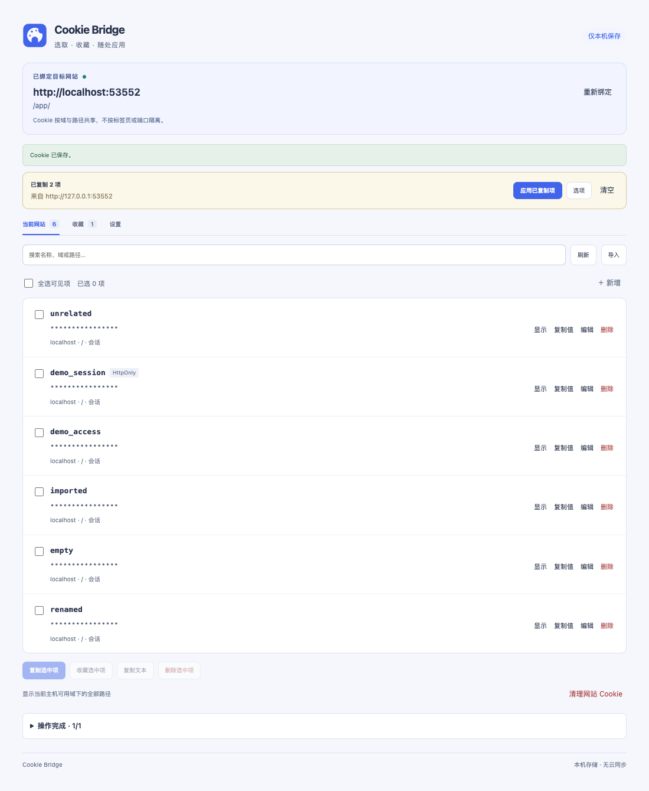

# Cookie Bridge

[English](README.md) | 简体中文

[](LICENSE)



视觉规范与品牌配色见 [设计文档](docs/design.md)。

Vue 3 + Vite + CRXJS 构建的 Chrome Manifest V3 Cookie 管理插件。在 A 网站选取任意 Cookie，临时复制或保存为收藏，再应用到当前 B 网站。无站点配对、无固定 Cookie 名称、无后端、无云同步。

## 安装与开发

需要 Chrome 120+，以及 Node.js 20.19+（20.x）或 22.12+；建议使用 Node 24。界面目前为中文。以下是从源码构建并加载扩展的安装方式。

```sh
git clone https://github.com/fanglinwei/cookie-bridge.git
cd cookie-bridge
npm ci
npm run check
```

在 Chrome 扩展管理页面启用“开发者模式”，点击“加载已解压的扩展程序”，选择 **`cookie-bridge/dist`**，然后固定插件图标。

日常开发：

```sh
npm run dev
```

CRXJS 开发服务固定使用 `127.0.0.1:5174`，避开常用业务项目的 5173。开发服务运行时加载生成的 `dist`；Vue 页面修改支持热更新。Manifest 或权限变更后在扩展管理页面手动重新加载。分发前停止开发服务并重新执行 `npm run build`，不要分发开发模式产物。

## 操作流程

1. 在来源网站打开插件，首次使用点击“授权当前网站”。
2. 勾选需要的 Cookie，点击“复制选中项”；或点击“收藏选中项”，命名为一个账号配置。
3. 切换到目标网站，打开插件并授权。
4. 点击“应用已复制项”或收藏的“应用到当前站”。全部写入且回读验证通过后默认刷新目标标签页。
5. 高级属性或路径需要调整时，使用“选项 / 应用选项”。已过期或不兼容的 Cookie 会提示处理，不能靠延长 Cookie 到期时间让服务端失效的 token 复活。

“复制值 / 复制文本”写入系统剪贴板；“复制选中项”只保存到插件内部临时区。

管理页绑定打开它的目标标签页。目标关闭或 URL 发生变化后，执行会停止；点击“重新绑定”明确采用该标签页的新地址。通过扩展设置直接打开、没有绑定目标的管理页仍可管理收藏及导入，读写网站需要从该网站的插件弹窗进入。

## Cookie 规则

- 收藏保留名称、值、域、路径、有效期、Secure、HttpOnly、SameSite 及来源网站信息。来源 URL 不保存查询参数与 fragment。
- 跨站默认映射到目标主机、路径 `/`，保留值及安全属性；不把来源域带入目标站。
- 相同名称、域、路径的项会被覆盖，其他 Cookie 保留。同名不同路径或父域冲突会列出来，明确选择保留或删除后才继续。
- 清理列出具体项并再次确认；父域 Cookie 可能影响其他子域。
- Cookie 不按端口或标签页隔离，多个 localhost 项目可能共享名称与路径相同的 Cookie。
- 一组写入不具备事务原子性。失败后停止后续项、不刷新、保留逐项结果；没有自动回滚。
- 编辑名称、域或路径时，先写入新项并验证，再删除原项；删除失败会明确报告部分完成。
- 收藏是固定快照。在来源站点使用“从来源更新”，预览后保存；缺少任何原收藏项时不覆盖旧快照。
- 首版支持普通窗口、未分区 Cookie。无痕和分区 Cookie 不进入操作范围。输入名称和值按 Cookie 文本规则校验，不自动转码。

## 数据与权限

必需权限为 `cookies`、`storage`、`activeTab`；HTTP/HTTPS 主机权限按需申请。设置页可查看及移除已授权网站。不注入网页脚本，不拦截网络请求，不执行网页或导入文本中的代码。

收藏和偏好使用 `chrome.storage.local`，临时复制使用 `chrome.storage.session`。存储仅向扩展可信上下文开放。收藏不自动上传，也不加密；卸载扩展会删除本机收藏。浏览器重启、扩展重载或更新会清除临时复制。

每份收藏 / 每次应用最多 200 项，最多 200 份收藏；导入上限 1 MB。Cookie 名称和值合计最多 4096 字节，Chrome 仍可能因属性长度或域规则拒绝写入。

## 导入

支持单行 Cookie 请求头的值：

```text
demo_session=example==; theme=dark
```

以及版本化 JSON。可参考 `examples/cookies.json`，文件仅含虚构演示值。JSON 缺少来源时标记“外部导入 / 来源未知”。只解析预览不会修改网站；需要再次点击应用或保存收藏。不承诺兼容其他插件的私有导出格式。

## 代码结构

| 文件 | 职责 |
| --- | --- |
| `manifest.json`、`vite.config.js` | MV3 权限、Vue/CRXJS 构建 |
| `src/App.vue`、`src/style.css` | 弹窗及管理页，共用操作和响应式布局 |
| `src/components/CookieEditor.vue` | 属性编辑表单 |
| `src/background.js` | Chrome API、串行写入、收藏及结果持久化 |
| `core.mjs` | 输入校验、导入、属性转换、冲突及批量执行逻辑 |
| `tests/core.test.mjs`、`tests/background.test.mjs` | 解析、属性转换、失败处理、授权及后台消息测试 |
| `tests/browser-smoke.mjs` | 隔离 Chrome 中的真实 API 和 Vue UI 冒烟测试 |

## 校验

```sh
npm test
npm run build
```

浏览器测试复用已有 Playwright 安装，不属于生产依赖。需要支持 DevTools `Extensions.loadUnpacked` 的较新 Chrome：

```sh
PLAYWRIGHT_MODULE=/absolute/path/to/playwright \
CHROME_PATH='/absolute/path/to/chrome' \
node tests/browser-smoke.mjs
```

测试启动隔离浏览器和生命周期内的临时 HTTP 站点，结束后关闭并清理。测试扩展副本仅预授权 localhost 与 127.0.0.1；生产 Manifest 的网站权限仍为可选。测试只使用虚构值，不读写用户的浏览器配置。截图及结果写入忽略版本控制的 `test-results/`。

真实业务验收时，请使用你有权访问的测试账号。插件成功提示只代表 Cookie 写入验证成功，不代表业务后台接受凭据或登录成功。

## 贡献与反馈

欢迎通过 [Issues](https://github.com/fanglinwei/cookie-bridge/issues) 报告问题或建议，通过 Pull Request 提交改进。

1. Fork 仓库，并为修改创建分支。
2. 安装依赖，保持修改范围集中；行为变更请添加或更新相应测试。
3. 执行 `npm run check`；涉及 Chrome API 或界面时，按上文运行浏览器测试，并手动验证首次授权。
4. 提交 PR，描述问题、修改及验证结果；界面修改请附截图。

报告问题时请提供 Chrome / Node.js 版本、复现步骤和预期行为。不要在 Issue、PR、截图或示例中提供真实 Cookie、token、账号或私有站点信息。Cookie 可能包含登录凭据，收藏以明文存储；仅对你有权访问的网站与账号操作。

## 许可证

本项目采用 [MIT License](LICENSE)，Copyright (c) 2026 Fun (fanglinwei)。第三方依赖遵循各自的许可证。
